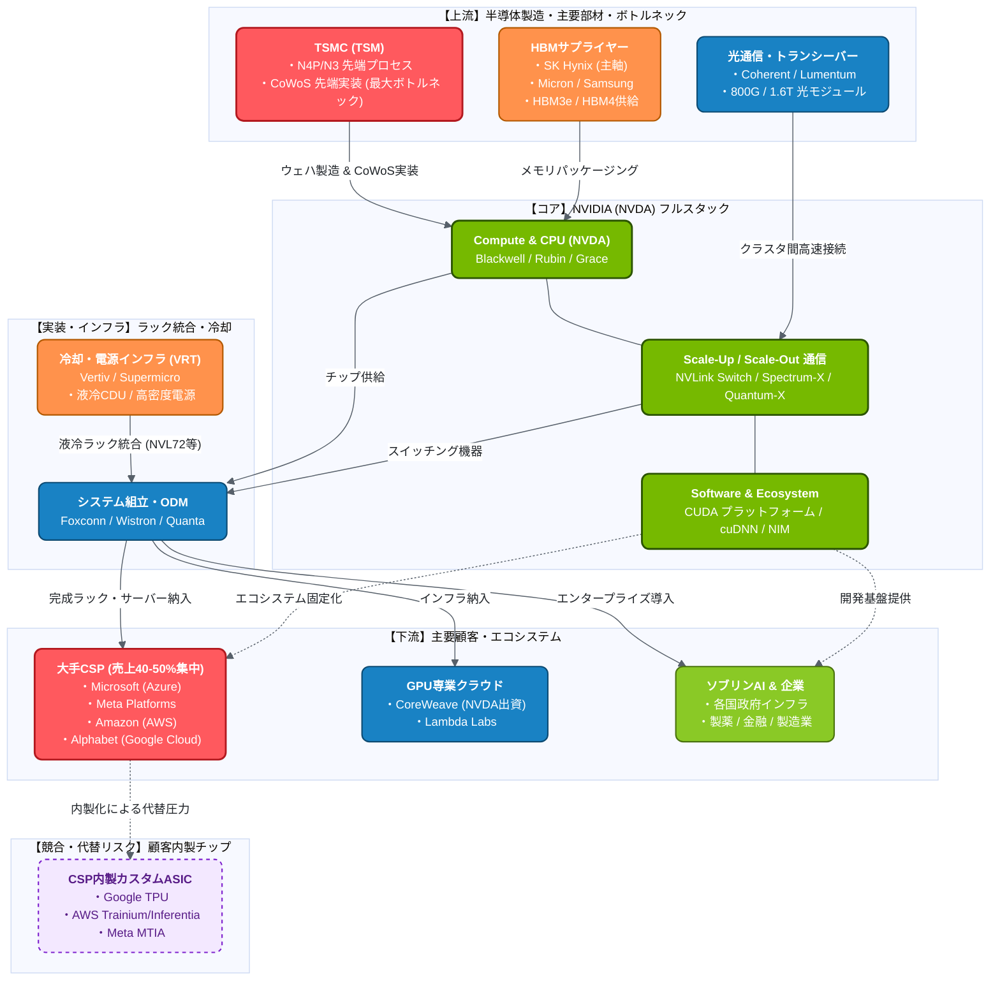

```mermaid
%%{init: {
  'theme': 'base',
  'themeVariables': {
    'fontFamily': 'system-ui, -apple-system, Segoe UI, Roboto, Helvetica, Arial, sans-serif',
    'fontSize': '13px',
    'primaryTextColor': '#1f2328',
    'lineColor': '#57606a',
    'edgeLabelBackground':'#ffffff'
  },
  'flowchart': {
    'curve': 'basis',
    'nodeSpacing': 40,
    'rankSpacing': 45,
    'padding': 12
  }
}}%%
flowchart TD
    %% サブグラフ：上流（半導体製造・主要部材）
    subgraph Upstream ["【上流】半導体製造・主要部材・ボトルネック"]
        direction LR
        TSMC["<b>TSMC (TSM)</b><br>・N4P/N3 先端プロセス<br>・CoWoS 先端実装 (最大ボトルネック)"]:::critical
        HBM["<b>HBMサプライヤー</b><br>・SK Hynix (主軸)<br>・Micron / Samsung<br>・HBM3e / HBM4供給"]:::high
        Optics["<b>光通信・トランシーバー</b><br>・Coherent / Lumentum<br>・800G / 1.6T 光モジュール"]:::medium
    end

    %% サブグラフ：コア製品・自社スタック
    subgraph Core ["【コア】NVIDIA (NVDA) フルスタック"]
        direction TB
        Chips["<b>Compute & CPU (NVDA)</b><br>Blackwell / Rubin / Grace"]:::nvda
        Interconnect["<b>Scale-Up / Scale-Out 通信</b><br>NVLink Switch / Spectrum-X / Quantum-X"]:::nvda
        Software["<b>Software & Ecosystem</b><br>CUDA プラットフォーム / cuDNN / NIM"]:::nvda
        Chips --- Interconnect --- Software
    end

    %% サブグラフ：インフラ統合・ラック実装
    subgraph Infrastructure ["【実装・インフラ】ラック統合・冷却"]
        direction LR
        ODM["<b>システム組立・ODM</b><br>Foxconn / Wistron / Quanta"]:::medium
        Cooling["<b>冷却・電源インフラ (VRT)</b><br>Vertiv / Supermicro<br>・液冷CDU / 高密度電源"]:::high
    end

    %% サブグラフ：下流（主要顧客・エンド市場）
    subgraph Downstream ["【下流】主要顧客・エコシステム"]
        direction LR
        Hyperscalers["<b>大手CSP (売上40-50%集中)</b><br>・Microsoft (Azure)<br>・Meta Platforms<br>・Amazon (AWS)<br>・Alphabet (Google Cloud)"]:::critical
        NeoCloud["<b>GPU専業クラウド</b><br>・CoreWeave (NVDA出資)<br>・Lambda Labs"]:::medium
        Sovereign["<b>ソブリンAI & 企業</b><br>・各国政府インフラ<br>・製薬 / 金融 / 製造業"]:::low
    end

    %% 競合・リスクファクター
    subgraph ASICs ["【競合・代替リスク】顧客内製チップ"]
        InHouse["<b>CSP内製カスタムASIC</b><br>・Google TPU<br>・AWS Trainium/Inferentia<br>・Meta MTIA"]:::risk
    end

    %% 接続フロー
    TSMC -->|"ウェハ製造 & CoWoS実装"| Chips
    HBM -->|メモリパッケージング| Chips
    Optics -->|クラスタ間高速接続| Interconnect

    Chips -->|チップ供給| ODM
    Interconnect -->|スイッチング機器| ODM
    Cooling -->|"液冷ラック統合 (NVL72等)"| ODM

    ODM -->|完成ラック・サーバー納入| Hyperscalers
    ODM -->|インフラ納入| NeoCloud
    ODM -->|エンタープライズ導入| Sovereign
    Software -.->|エコシステム固定化| Hyperscalers
    Software -.->|開発基盤提供| Sovereign

    Hyperscalers -.->|内製化による代替圧力| InHouse

    %% ==========================================
    %% 各ノードへのリンク（TradingViewチャート）設定
    %% ==========================================
    click TSMC "[https://jp.tradingview.com/symbols/NYSE-TSM/](https://jp.tradingview.com/symbols/NYSE-TSM/)" "TSMC (TSM) のチャートを開く" _blank
    click Chips "[https://jp.tradingview.com/symbols/NASDAQ-NVDA/](https://jp.tradingview.com/symbols/NASDAQ-NVDA/)" "NVIDIA (NVDA) のチャートを開く" _blank
    click Cooling "[https://jp.tradingview.com/symbols/NYSE-VRT/](https://jp.tradingview.com/symbols/NYSE-VRT/)" "Vertiv (VRT) のチャートを開く" _blank
    click Optics "[https://jp.tradingview.com/symbols/NYSE-COHR/](https://jp.tradingview.com/symbols/NYSE-COHR/)" "Coherent (COHR) のチャートを開く" _blank

    %% スタイル定義
    classDef nvda fill:#76b900,stroke:#2b5400,stroke-width:2px,color:#ffffff,rx:8px,ry:8px;
    classDef critical fill:#ff595e,stroke:#b3191f,stroke-width:2px,color:#ffffff,rx:8px,ry:8px;
    classDef high fill:#ff924c,stroke:#b35900,stroke-width:1.5px,color:#ffffff,rx:8px,ry:8px;
    classDef medium fill:#1982c4,stroke:#0d4b73,stroke-width:1.5px,color:#ffffff,rx:8px,ry:8px;
    classDef low fill:#8ac926,stroke:#4a730e,stroke-width:1.5px,color:#ffffff,rx:8px,ry:8px;
    classDef risk fill:#f3e8ff,stroke:#7e22ce,stroke-width:1.5px,stroke-dasharray: 4 4,color:#581c87,rx:8px,ry:8px;
```
