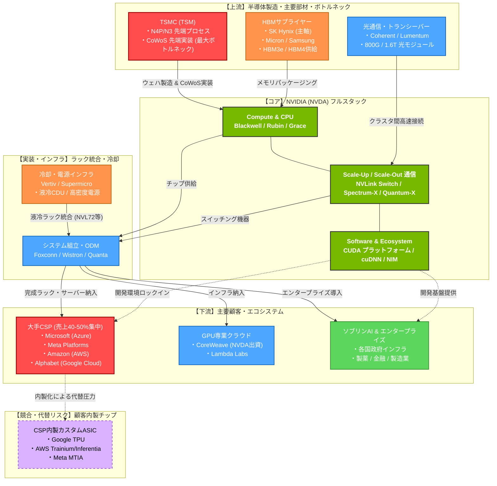

```mermaid
flowchart TD
    %% サブグラフ：上流（半導体製造・主要部材）
    subgraph Upstream ["【上流】半導体製造・主要部材・ボトルネック"]
        TSMC["TSMC (TSM)<br>・N4P/N3 先端プロセス<br>・CoWoS 先端実装 (最大ボトルネック)"]:::critical
        HBM["HBMサプライヤー<br>・SK Hynix (主軸)<br>・Micron / Samsung<br>・HBM3e / HBM4供給"]:::high
        Optics["光通信・トランシーバー<br>・Coherent / Lumentum<br>・800G / 1.6T 光モジュール"]:::medium
    end

    %% サブグラフ：コア製品・自社スタック
    subgraph Core ["【コア】NVIDIA (NVDA) フルスタック"]
        direction TB
        Chips["Compute & CPU<br>Blackwell / Rubin / Grace"]:::nvda
        Interconnect["Scale-Up / Scale-Out 通信<br>NVLink Switch / Spectrum-X / Quantum-X"]:::nvda
        Software["Software & Ecosystem<br>CUDA プラットフォーム / cuDNN / NIM"]:::nvda
        Chips --- Interconnect --- Software
    end

    %% サブグラフ：インフラ統合・ラック実装
    subgraph Infrastructure ["【実装・インフラ】ラック統合・冷却"]
        ODM["システム組立・ODM<br>Foxconn / Wistron / Quanta"]:::medium
        Cooling["冷却・電源インフラ<br>Vertiv / Supermicro<br>・液冷CDU / 高密度電源"]:::high
    end

    %% サブグラフ：下流（主要顧客・エンド市場）
    subgraph Downstream ["【下流】主要顧客・エコシステム"]
        Hyperscalers["大手CSP (売上40-50%集中)<br>・Microsoft (Azure)<br>・Meta Platforms<br>・Amazon (AWS)<br>・Alphabet (Google Cloud)"]:::critical
        NeoCloud["GPU専業クラウド<br>・CoreWeave (NVDA出資)<br>・Lambda Labs"]:::medium
        Sovereign["ソブリンAI & エンタープライズ<br>・各国政府インフラ<br>・製薬 / 金融 / 製造業"]:::low
    end

    %% 競合・リスクファクター（点線連携）
    subgraph ASICs ["【競合・代替リスク】顧客内製チップ"]
        InHouse["CSP内製カスタムASIC<br>・Google TPU<br>・AWS Trainium/Inferentia<br>・Meta MTIA"]:::risk
    end

    %% 接続フロー
    TSMC -->|"ウェハ製造 & CoWoS実装"| Chips
    HBM -->|メモリパッケージング| Chips
    Optics -->|クラスタ間高速接続| Interconnect

    Chips -->|チップ供給| ODM
    Interconnect -->|スイッチング機器| ODM
    Cooling -->|"液冷ラック統合 (NVL72等)"| ODM

    ODM -->|完成ラック・サーバー納入| Hyperscalers
    ODM -->|インフラ納入| NeoCloud
    ODM -->|エンタープライズ導入| Sovereign
    Software -.->|開発環境ロックイン| Hyperscalers
    Software -.->|開発基盤提供| Sovereign

    Hyperscalers -.->|内製化による代替圧力| InHouse

    %% スタイル定義
    classDef nvda fill:#76b900,stroke:#333,stroke-width:2px,color:#fff,font-weight:bold;
    classDef critical fill:#ff4d4d,stroke:#900,stroke-width:2px,color:#fff;
    classDef high fill:#ff944d,stroke:#b35900,stroke-width:1.5px,color:#fff;
    classDef medium fill:#4da6ff,stroke:#0059b3,stroke-width:1.5px,color:#fff;
    classDef low fill:#5cd65c,stroke:#2d862d,stroke-width:1.5px,color:#fff;
    classDef risk fill:#d9b3ff,stroke:#6600cc,stroke-dasharray: 5 5,color:#000;
```
